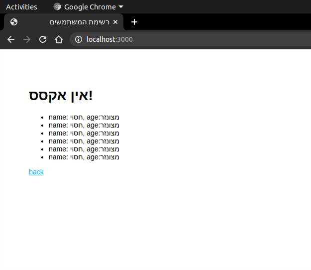

# middleware-exercise instructions
*You will need to add THREE middlewares to existing express project*

מה קורה כרגע בפרויקט:
במסך הראשי למשתמש יש טופס בו יש למלא שם משתמש וגיל
לאחר מכן מוצגת לו רשימת כל המשתמשים וגילם

# התרגיל
עליכם להוסיף שלושה

middlewares:


# 1st middleware
*user name and age validation*

Check that length of user name is greater than 1

Check that user name includes only English letters (a-zA-Z) and spaces

Check that age is a number and is a valid number (does not start with 0)

If info is not valid, return an error: 
```
    { message: "error message goes here" }
```

# 2nd middleware
*under 18 age censor*

If age is under 18, override route's render so it will SEND an object with a list of users in which all ages and user names are censored, and in this case, DO NOT add the under-age user to our users list

censored list example:



# 3rd middleware
*browser-agents count for each valid POST*

Keep count of how many POST requests each browser-agent has done

In this middleware, if req is a POST request, increase count for current browser-agent by 1

Display most popular agent-browser (and POSTs count) on home page (change topBro variable on router.get('/', ...) in ./routes/index.js)