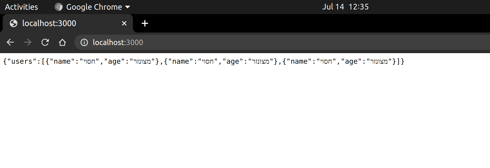

# middleware-exercise instructions
*You will need to add THREE middlewares to existing express project*

מה קורה כרגע בפרויקט:
במסך הראשי למשתמש יש טופס בו יש למלא שם משתמש וגיל
לאחר מכן הוא מועבר לעמוד בו רואים את את רשימת כל המשתמשים ואת גילם

עליכם להוסיף שלושה
middlewares 

# 1st middleware
*user name and age validation*

Check that length of user name is greater than 1
Check that user name includes only English letters (a-zA-Z) and spaces
Check that age is a number and is a valid number (does not start with 0)

If info is not valid, return an error: 
```
    { message: "error message goes here" }
```

# 2nd middleware
*under 18 age censor*
If age is under 18, override the '/users' route render (res.render()) with a list of users in which all ages and user names are censored, and in this case, do not add the under-age user to our users list



# 3rd middleware

# middleware 1:
 לבדוק האם האורך של השם גדול מ-1, האם בשם יש רק אותיות באנגלית ורווחים והאם הגיל הוא מספר 
 (לא יכול להתחיל ב-0)
אם יש שגיאה - להחזיר שגיאה
(בתור אובייקט 
```
    { message: "error message goes here" }
```
)

# middleware 2:
לבדוק האם הגיל מעל 18. אם כן ממשיכים כרגיל, אם לא, דורסים את ה
render
 עם רשימה שבה כל השמות חסויים וכל הגילאים מצונזרים ולא מכניסים את המשתמש הצעיר לרשימת המשתמשים.

# middleware 3:
כמה בקשות 
POST  
נעשו מכל דפדפן?
 בכל בקשת
 POST 
מעלים ב-1 את מספר הבקשות מהדפדפן הנוכחי. 
מציגים למשתמש מהו הדפדפן שעשו ממנו הכי הרבה 
POSTs
 וכמה פעמים זה קרה.

